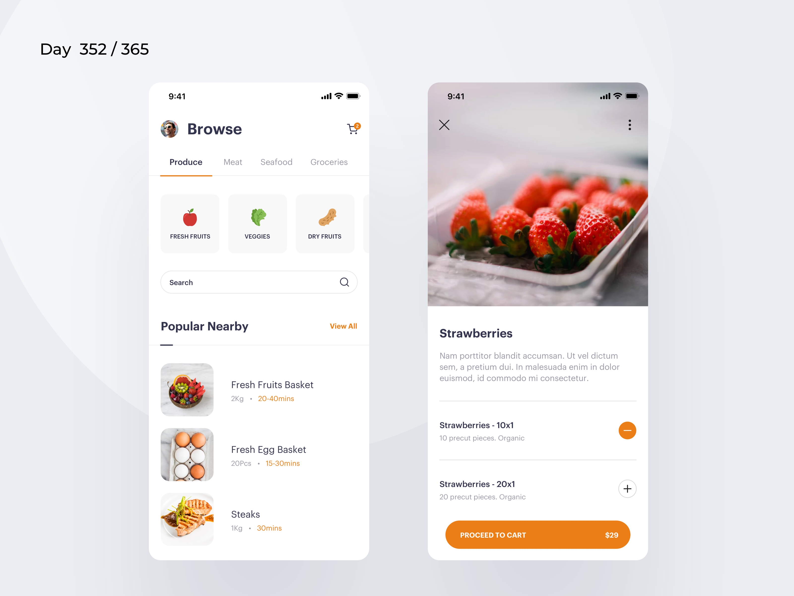
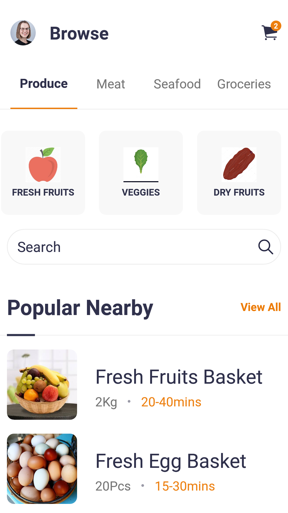
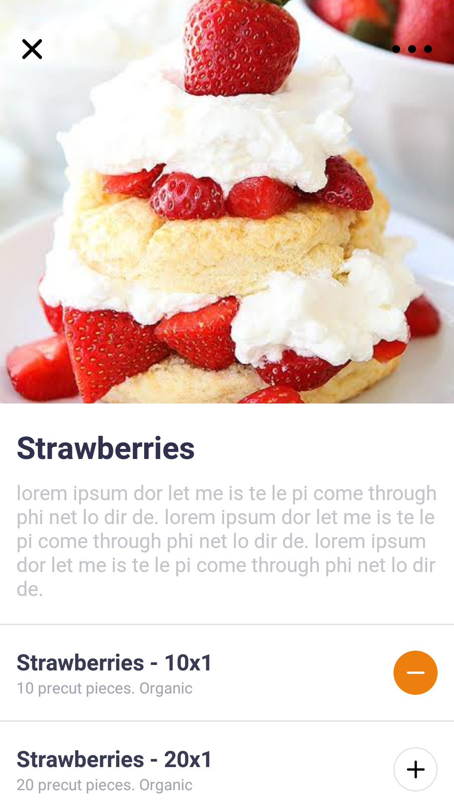
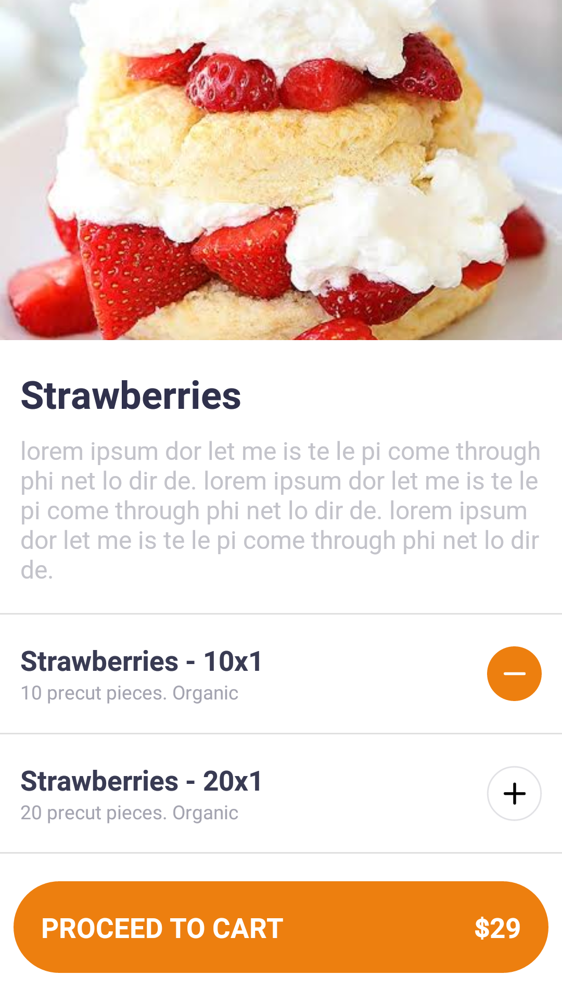
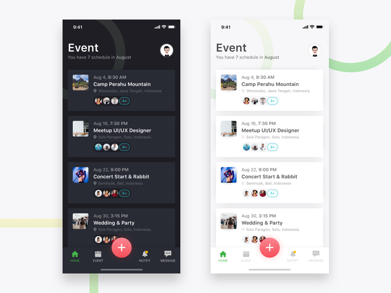
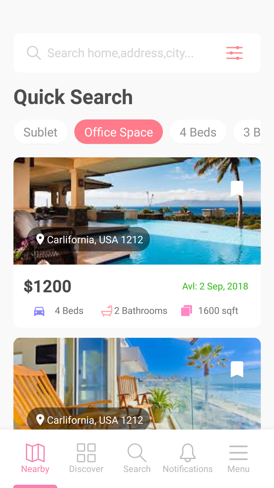
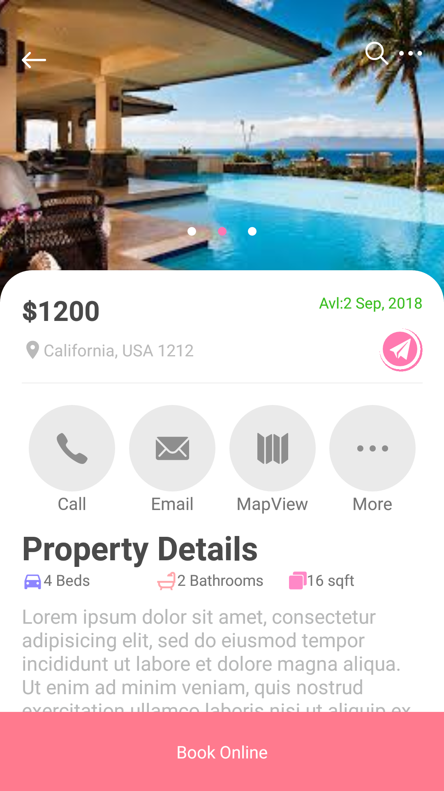

# React-Native-Layouts

React-Native-Layouts is collection of UIs created using mockups from <a>https://dribbble.com/.

### App Gallery.

Here is a sample of the completed apps with there respective mockups.

1. Groceries

    * mockup

        

    * Final App screnshot.

        

        

        

1. EventsApp

    * mockup

        

    * Final App screnshot.

        

1. VacationHome
    * mockup

        

    * Final App screnshot.

        

        

### Getting Started


These instructions will get you a copy of the project up and running on your local machine for development and testing purposes.

* Open your command console and the clone  the repository to local machine using this command.

```
    git clone https://github.com/Albystein/React-Native-Layouts.git

```

The above command will clone all the projects to your local development environment. To start working on given project, change into it's directory. For example assuming I wanted to work on the <i>EventsApp. In your current directory type this.

```bash
    cd React-Native-Layouts/

    cd EventsApp/

```


- The next step is to install the required *node_modules* using the following command.This will install all the required modules for this project.


```bash
    npm install
```

Once the above command is done running, you should be able to run the app. Make sure to have your Android Emulator running or Android Device connected.

* To run the app, run the following command in your console.

```bash
    react-native run-android
```


*Disclaimer* : The apps will be able to run as expected only in Android. For iOS developers, there will be minor alterations since it was originally built and tested on an Android Phone. 


Henceforth, you can start editing and customizing the apps.